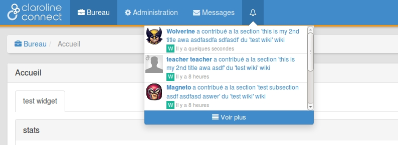

NotificationBundle
==================

Notification bundle for Claroline Connect. See https://github.com/claroline/Claroline

[Here](https://github.com/iCAPLyon1/NotificationBundle/blob/master/Resources/doc/system_description.md) is an analysis of what the Notification system does.



Installation
-------------------------

This bundle is a required bundle from CoreBundle. It is needed so the Core can work properly.

However if you want to install it manually here is the package in composer:

`composer require icap/notification-bundle "dev-master"`

Prerequisites
------------------------

*	*User* class must provide methods: getId(), getFirstName(), getLastName() and getPicture() (user's avatar)
*	*Resource* class must provide methods: getId(), getClass() 
*	In config.yml the following fields need to be informed:
    - default_layout : the layout from which the notification list page will extend (default ClarolineCoreBundle::layout.html.twig)
    - max_per_page : the maximum number of notifications per page in notification list page (default 50)
    - dropdown_items : the number of notifications present in the dropdown list (default 10)
    - system_name : the system's name; used when action has no doer (default Claroline)

How to use in plugins
-----------------------------

In order to integrate and enable notifications in a Claroline connect plugin you need to follow these steps:

1.  Add
    ``
    somewhere in your interface to render the button that allows user to enable and disable notifications for a resource.     As you can see, 2 parameters are required, the resource node id and the resource node class. 
    
    
2.  Any event that you want to generate a notification needs to implement the *NotifiableInterface*. This interface has 9 methods.
    -   getSendToFollowers() : returns true or false if event can notify the resource's followers
    -   getIncludeUserIds() : returns a list of User ids that will receive the notification (extra Users that are not necessarily in followers list)
    -   getExcludeUserIds() : returns a list of User ids that must not receive the notification (this Users can be either in followers list or includeUsers list)
    -   getDoer() : returns the User whose action raised the notification (this method already exists in LogGenericEvent class)
    -   getActionKey() : returns a sting with the name/key of the action performed
    -   getIconKey() : returns a string, usually the name of the resource type e.g. "wiki" and is used to generate a color for every notification that has the same icon name. This color is the mini icon's background color and as text content for this icon is used the first letter of the icon key.
    -   getResource() : returns the resource on which the action was performed (this method already exists in LogGenericEvent class)
    -   getNotificationDetails() : returns an array (JsonArray in database) which contains informations about the resource name, id and type as well as other information, necessary to render the notification text. All the information about the "doer" are added by the Notification plugin automatically. All the rest (resource, etc.) need to be added manually.
    -   isAllowedToNotify() : returns true or false and informs CoreBundle that this event raises or not a notification. It can test a condition and if this condition fails no notification is created or sent, else if condition is fulfilled a notification is created and sent to users.
    
    You can use the example of the [LogContributionCreateEvent](https://github.com/iCAPLyon1/WikiBundle/blob/master/Event/Log/LogContributionCreateEvent.php) in the WikiBundle to guide you. 

3.  Create a domain for translations under translations folder following the name pattern `notification.lang.yml`
4.  Under views folder create a `Notification` folder and store inside all views related to notifications' display/rendering. It is recommended to create a general twig file say `notification_item.html.twig` which will extend the `IcapNotificationBundle:Templates:notification.html.twig` template, will render all common elements and include any other necessary template according to the action type. An example is given [here](https://github.com/iCAPLyon1/WikiBundle/blob/master/Resources/views/Notification/notification_item.html.twig)
5.  Create `NotificationListener` class under Listener folder which will "listen" to plugin's notification events and render the notification item. You can checkout the [NotificationListener](https://github.com/iCAPLyon1/WikiBundle/blob/master/Listener/NotificationListener.php) class in the WikiBundle
6.  Add in a config file e.g. `listeners.yml` the service that will listen to plugin's events and redirect the to your NotificationListener class calling the right method. [Here](https://github.com/iCAPLyon1/WikiBundle/blob/master/Resources/config/services/listeners.yml) is the example for WikiBundle

You can find a complete example of these steps in [iCAPLyon1/WikiBundle](https://github.com/iCAPLyon1/WikiBundle)

Please enable notification only for events that inform of content creation/addition. Not for content deletion. Otherwise a user will be lost in a "notification overload".


#### Integrate user tagging in plugins

If you want to allow users to tag and notify other users then you should follow these steps:

1.  For every entity in your plugin that contains text, implemented by a tinymce editor (for example a post in a blog, a contribution in a wiki etc.) you need to create:
    -   A protected variable to store the user picker object (contains the information about the original text, the final text, as long as the list of tagged users)
        ```
            protected $userPicker = null;
        ```
    -   Develop a `@ORM\PrePersist` method that instanciates userPicker and swaps originalText with finalText.
                     /**
                      * @ORM\PrePersist
                      */
                     public function createUserPicker(LifecycleEventArgs $event){
                         if ($this->getText() != null) {
                             $userPicker = new UserPickerContent($this->getText());
                             $this->setUserPicker($userPicker);
                             $this->setText($userPicker->getFinalText());
                         }
                     }
        
    -   Create an entity listener class and associate it with your entity. Here is an example (for Contribution entity in WikiBundle):
        ```
            @ORM\EntityListeners({"Icap\WikiBundle\Listener\ContributionListener"})
        ```
        This entity Listener is responsible to create a notification and notify every tagged user on entity's postPersist event.
        [Here](https://github.com/iCAPLyon1/WikiBundle/blob/master/Listener/ContributionListener.php) is the example of the Contribution listener.

2.  Add in `listeners.yml` file a line for the new event.
    Example:
    ```
        - { name: kernel.event_listener, event: create_notification_item_resource-icap_wiki-user_tagged, method: onCreateNotificationItem }
    ```
3.  Handle the rendering of the new notification event. (Create dedicated view etc.)
    [Here](https://github.com/iCAPLyon1/WikiBundle/blob/master/Resources/views/Notification/notification_user_tagged.html.twig) is this view for the wiki bundle and [here](https://github.com/iCAPLyon1/WikiBundle/blob/master/Resources/views/Notification/notification_item.html.twig)
    is the modified notification_item view to include the new event.


